# Agentic Personal Banking Platform

An enterprise AI banking platform demo where multiple AI agents collaborate to
recommend banking products based on customer behaviour. FastAPI backend serving
mock data over REST; React frontend consuming it.

## Screenshots

| Dashboard | Customers |
| --- | --- |
| 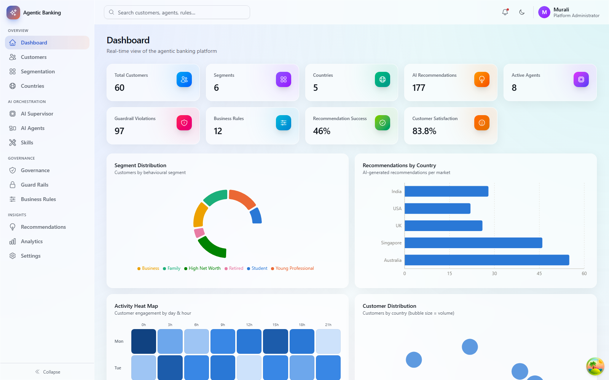 | 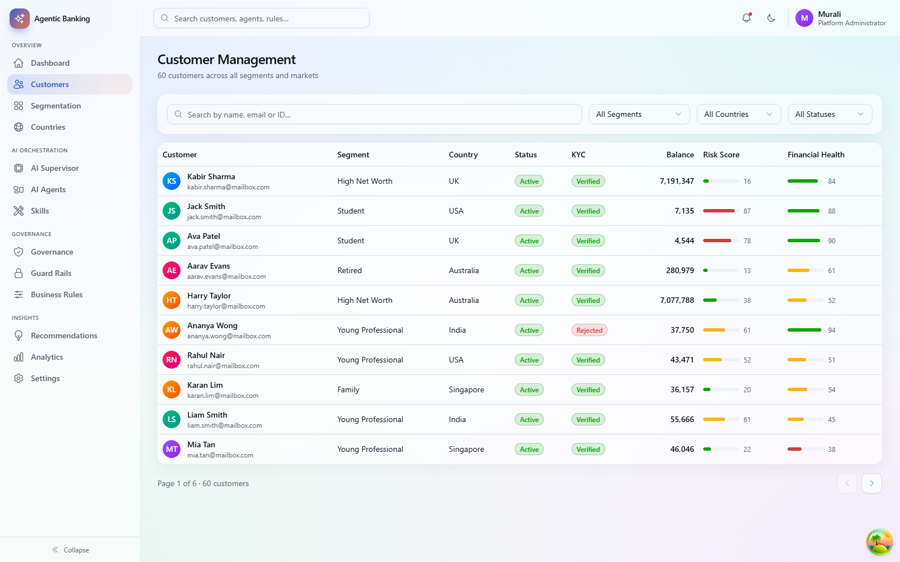 |

| Segmentation | AI Supervisor |
| --- | --- |
| 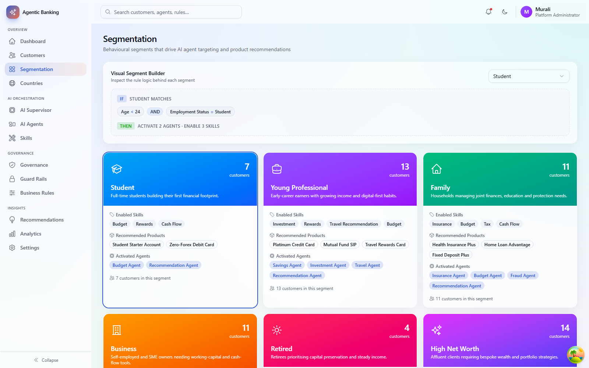 | 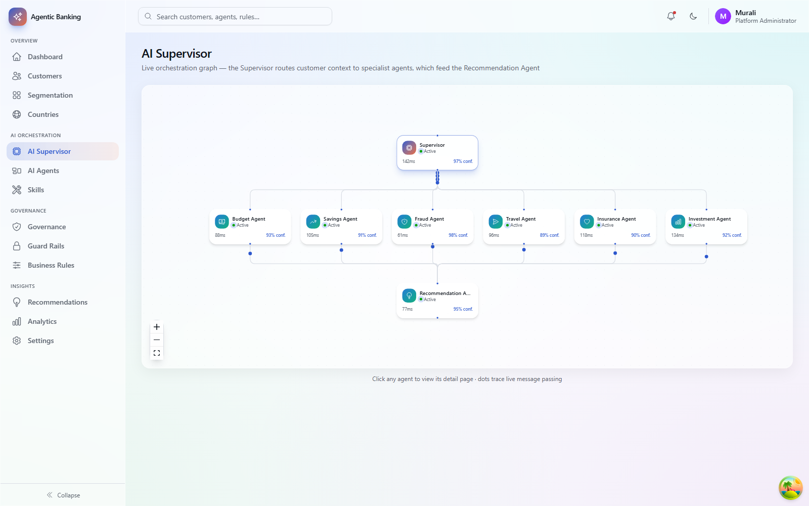 |

| AI Agents | Governance |
| --- | --- |
| 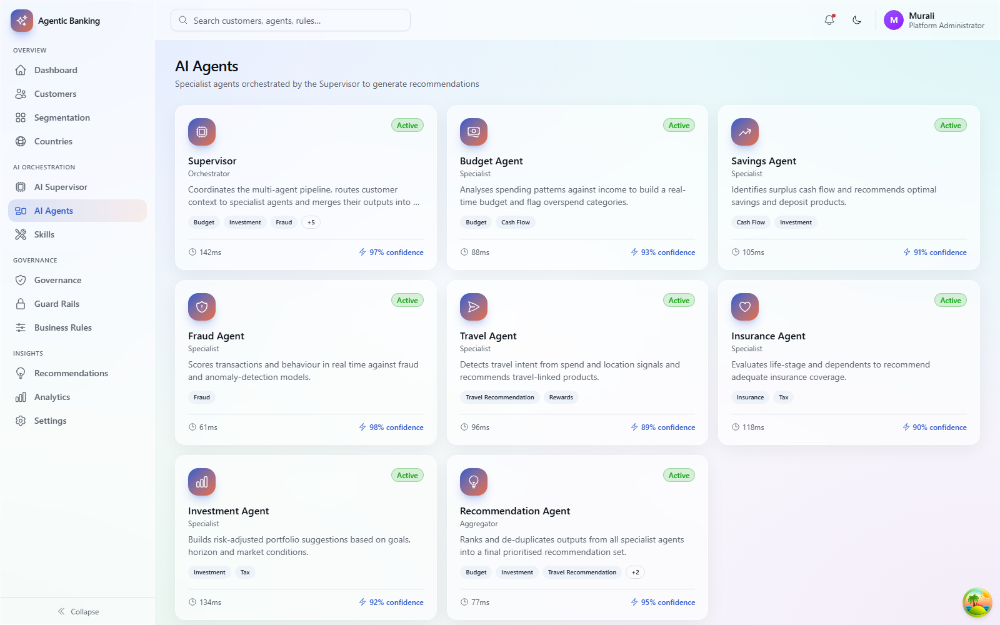 | 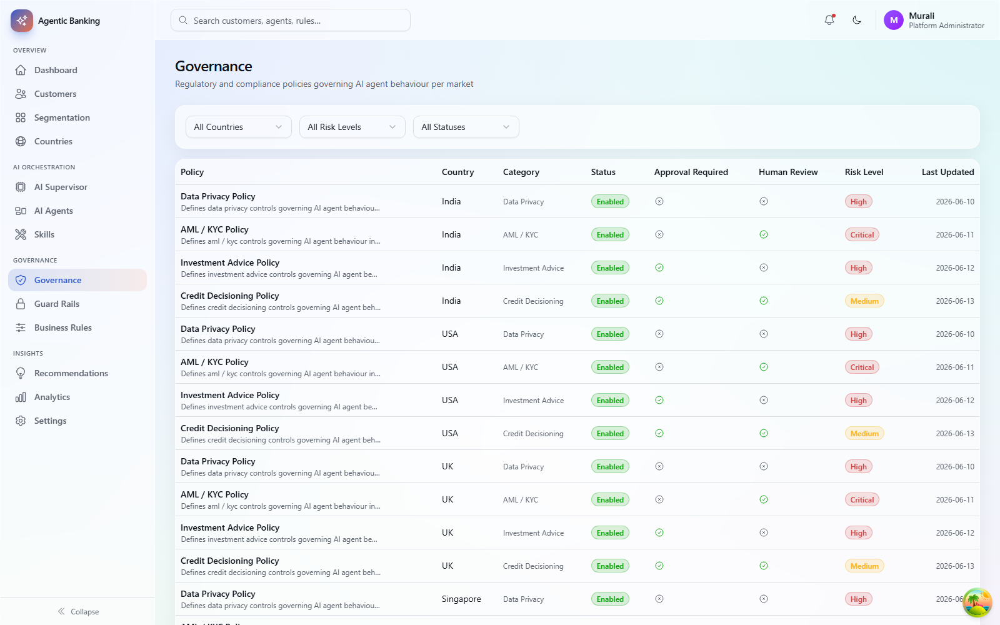 |

| Recommendations | Analytics |
| --- | --- |
| 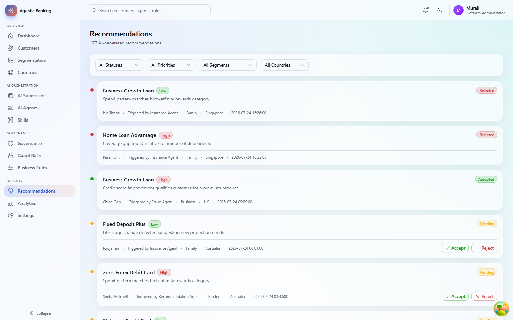 | 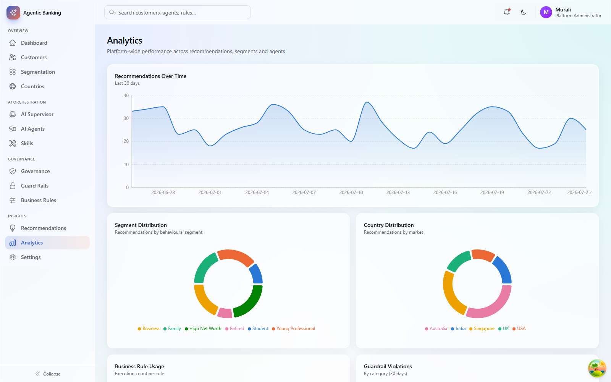 |

| Customer Detail | Countries |
| --- | --- |
| 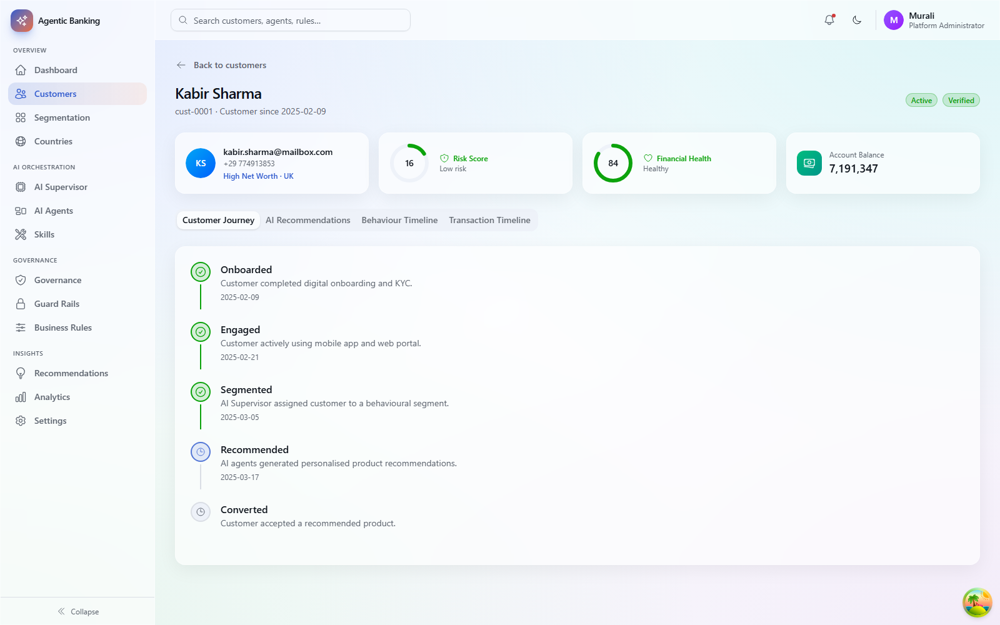 | 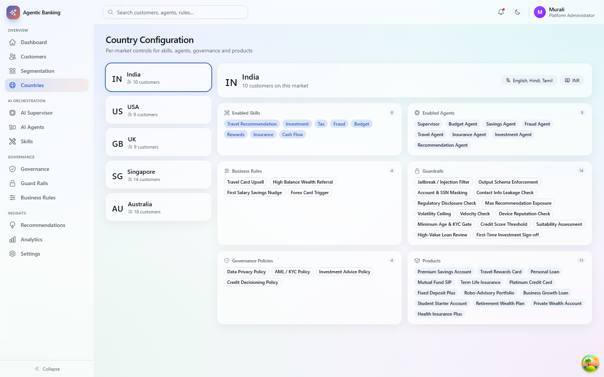 |

| Agent Detail | Guard Rails |
| --- | --- |
| 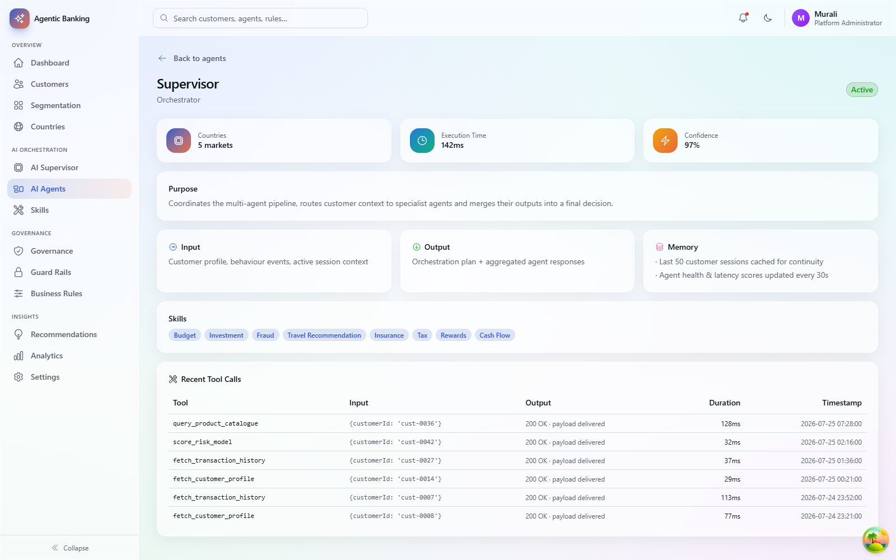 | 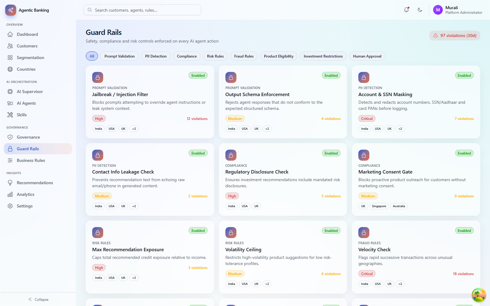 |

| Business Rules | Skills |
| --- | --- |
| 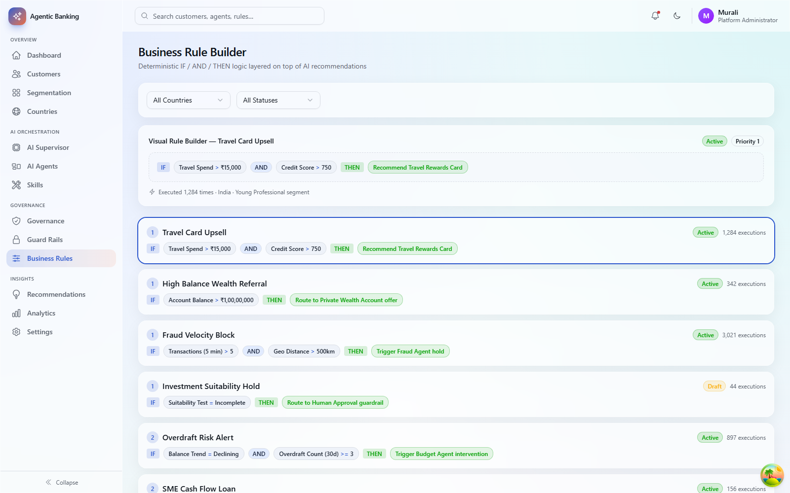 | 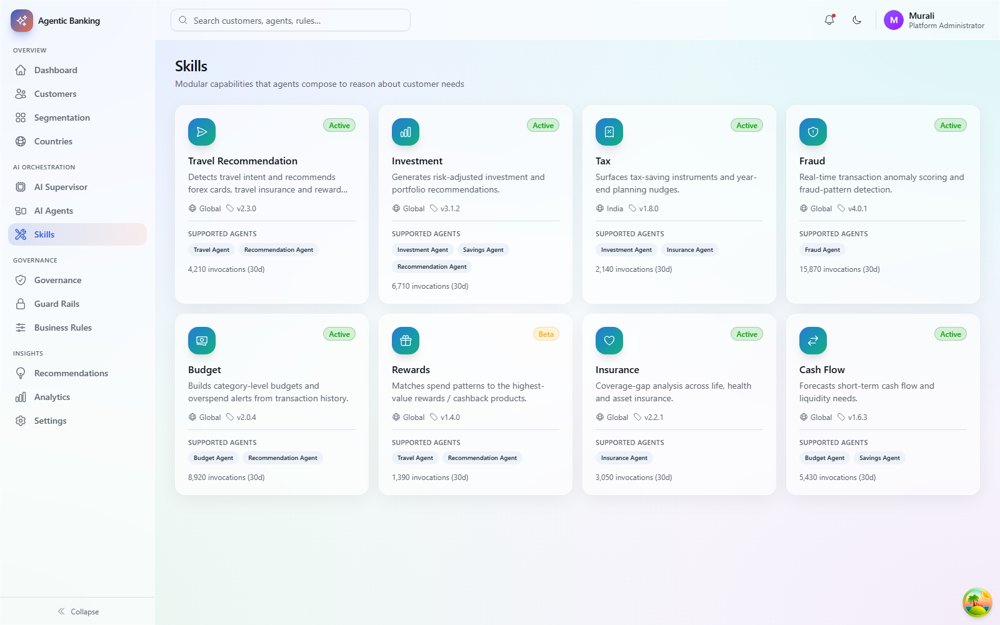 |

| Settings |  |
| --- | --- |
| 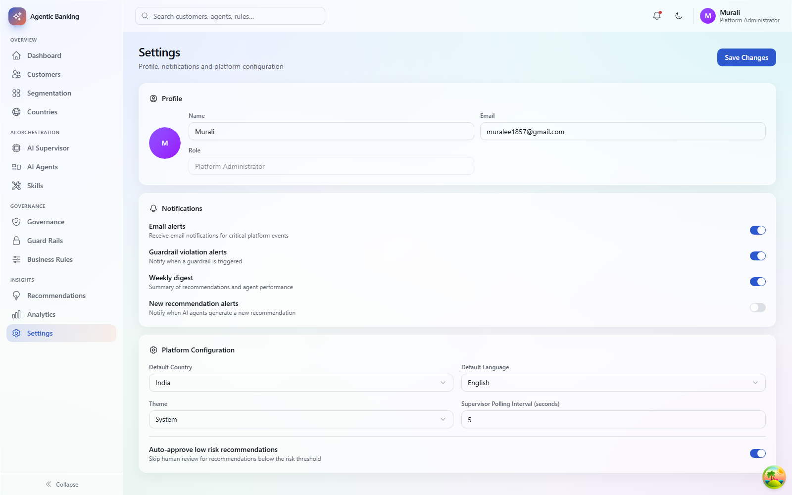 |  |

## Structure

- `backend/` — FastAPI (Python), serves mock data under `/api/v1`
- `frontend/` — React 19 + TypeScript + Vite, Tailwind v4, shadcn/ui, React Query,
  Zustand, React Router, React Flow, Framer Motion, Recharts

## Prerequisites

- Python 3.11+ and `pip`
- Node.js 20+ and `npm`

## Backend setup

```bash
cd backend
python -m venv .venv
./.venv/Scripts/activate   # Windows; use `source .venv/bin/activate` on macOS/Linux
pip install -r requirements.txt
uvicorn app.main:app --reload --port 8000
```

- API docs (Swagger UI): http://127.0.0.1:8000/docs
- Health check: http://127.0.0.1:8000/health
- All routes are served under the `/api/v1` prefix (e.g. `/api/v1/customers`)

### Backend configuration

Settings live in `backend/app/core/config.py` (via `pydantic-settings`) and can
be overridden with environment variables of the same name:

| Setting        | Default                                               | Purpose                          |
| -------------- | ------------------------------------------------------ | --------------------------------- |
| `app_name`     | `AI Agentic Personal Banking Platform API`             | Shown in the API root/docs        |
| `api_prefix`   | `/api/v1`                                              | Prefix for all router endpoints   |
| `cors_origins` | `http://localhost:5173`, `http://127.0.0.1:5173`        | Origins allowed to call the API   |

If you serve the frontend from a different host/port, add it to `cors_origins`
(e.g. `CORS_ORIGINS='["http://localhost:3000"]' uvicorn app.main:app --port 8000`).

Data is in-memory and regenerated on backend restart — there is no database.

## Frontend setup

```bash
cd frontend
npm install
cp .env.example .env   # adjust VITE_API_BASE_URL if the backend runs elsewhere
npm run dev
```

App: http://localhost:5173

### Frontend configuration

Configuration is via `frontend/.env` (see `.env.example`):

| Variable              | Default                              | Purpose                        |
| --------------------- | ------------------------------------- | ------------------------------- |
| `VITE_API_BASE_URL`   | `http://127.0.0.1:8000/api/v1`        | Base URL the frontend calls    |

Other useful scripts:

```bash
npm run build     # type-check and build for production (output in frontend/dist)
npm run preview   # preview the production build locally
npm run lint       # run oxlint
```

## Running both together

1. Start the backend first (`uvicorn app.main:app --reload --port 8000`).
2. In a second terminal, start the frontend (`npm run dev` from `frontend/`).
3. Open http://localhost:5173 — the app talks to the backend via `VITE_API_BASE_URL`.

If the backend runs on a different host/port, update both
`frontend/.env` (`VITE_API_BASE_URL`) and the backend's `cors_origins` to match.
